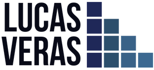

  
  
  

Hello, I'm Lucas, a brazilian software developer based in Portugal. I mainly work with web development and data science, and I'm always eager to learn new skills.

## Tech stack

  
  
  
  
  
  
  

